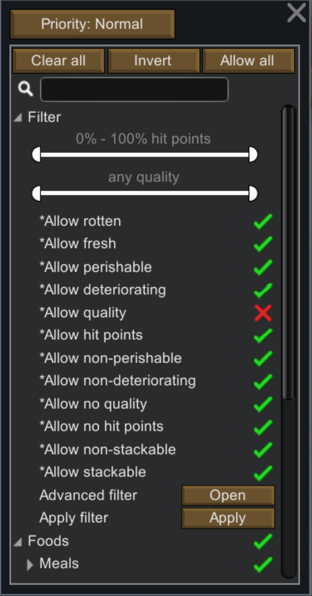
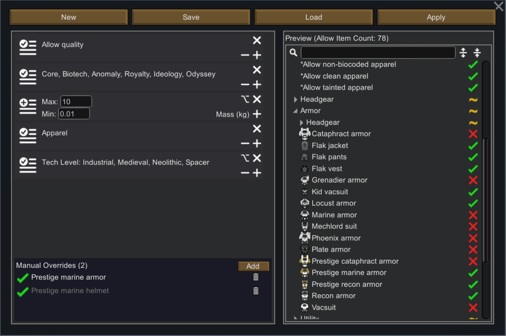

# [UR] Better Filter for Storage, Food and Clothes Restrictions

**A better storage filter for RimWorld — faster category navigation, more flexible paste options, finer-grained item filtering.**

## Main Features

### Filter Tree Navigation

* 【Invert】button: a one-click toggle between "Clear All" and "Allow All" that flips every item's allow/disallow state. Does not affect filter workers themselves.

* 【Expand/Collapse One Level】buttons: two arrow buttons next to the search bar expand or collapse the category tree one level at a time, simplifying manual browsing.

### Paste Storage Settings Enhancement

* Left-click paste retains vanilla behavior (overwrite).

* Right-click the paste icon for two new overlay modes:
  - **Add Allowed Items**: currently disallowed + clipboard allowed → allowed
  - **Add Disallowed Items**: currently allowed + clipboard disallowed → disallowed

### Outfit / Food Policy Enhancement

* New 【Copy】【Paste】buttons with independent clipboards — outfits and food each have their own.

* New 【Advanced Filter】button opens a multi-condition filter builder with save/load support.

* Paste also supports Overwrite, Add Allowed, and Add Disallowed modes.

## New Filters

This mod adds 10 item filters in 5 complementary pairs:

* Perishable / Non-Perishable — whether refrigeration is needed

* Deteriorating / Non-Deteriorating — whether it degrades outdoors (a deterioration rate of 0 is treated as non-deteriorating)

* Has Quality / No Quality — whether it has quality grades

* Has Hit Points / No Hit Points — whether it has durability

* Non-Stackable / Stackable — stack limit is 1 or ≥ 2

All new filters are based on an item's inherent properties; results are predictable and do not change during gameplay.

## Filter Category & Apply

* New filters and selected vanilla static-property filters are grouped into a pinned filter category for convenient access.

* The 【Apply】button in this category pushes filter-worker states down to individual items (disallowed filter → disallow matching items), then resets the filter workers to allowed. The list of participating filters can be configured in mod settings.

## Advanced Filter

The mod adds an 【Advanced Filter】entry point in both the storage filter and policy management screens, supporting complex filtering rules:

* Supports filter-worker matching, mod matching, category matching, numeric matching, enum matching, and manual per-item overrides

* Multiple filters are combined with **intersection** (logical AND): an item must pass every filter to be allowed

* Within a single filter, conditions are combined with **union** (logical OR): an item matching any one condition is allowed

* Each filter can switch between whitelist (allow matching) / blacklist (disallow matching) mode — click the badge on the left to toggle

* Numeric and enum filters support Loose (allow items without the property) / Strict (disallow items without the property) strategy — click the option icon at the top-right to toggle

### About Each Filter Type

* **Worker Filter:** [+] to add matching filters (e.g. "Has Hit Points", "Adult Apparel", etc.), [-] to remove the most recently added filter. Multiple filters can be added. The available filter list is set in mod settings and is the same as the applicable filter list.

* **Mod Filter:** matches items by their source mod. [+] to add a mod name. Items from any selected mod are allowed.

* **Category Filter:** matches items by their item category (e.g. Food, Manufactured, Raw Resources, etc.). Items in any selected category are allowed.

* **Numeric Filter:** matches items by a numeric property. Enter a min/max range to select items whose property value falls within that range. Loose strategy additionally allows items without the property.
  *【Note: this module is still in development. Currently supports Stack Limit and Mass matching; arbitrary numeric property paths will be supported in the future.】*

* **Enum Filter:** matches items by an enumerable property. [+]/[-] to adjust the enum values to match. For example, with the "Tech Level" property, selecting Medieval and Industrial matches only items tagged with those tech levels.
  *【Note: this module is still in development. Currently supports Weapon Tags, Apparel Tags, Trade Tags, Tech Level, Apparel Layer, and Body Coverage; arbitrary enum property paths will be supported in the future.】*

* **Manual Override:** add specific item definitions to manually determine the final match result. Override values take priority over all filter results. When an override is inactive (not changing the item's allow status), the item name appears in gray.

**Filter sets can be saved, loaded, and appended. When importing, names that have disappeared due to mod changes are marked in gray *name format and can still be used — especially designed for complex mod environments.**

Advanced filters also support **argparse-style command-line input**:

* Worker filter: `worker -d SpecialThingFilterDef [SpecialThingFilterDef ...] [-b] [-u]`

* Mod filter: `mod -d PackageID [PackageID ...] [-b] [-u] `

* Category filter: `cat -d ThingCategoryDef [ThingCategoryDef ...] [-b] [-u] `

* Numeric filter: ` value -d ValuedAttrName -v Min Max [-b] [-l] [-u]` — for -v values, use the letter n to mean no limit, and n followed by digits for negative numbers

* Enum filter: ` enum -d EnumAttrName -v EnumValue [EnumValue ...] [-b] [-l] [-u]`

* Item override: `item -d DefName [DefName ...] [-b] [-u]`

The -b flag sets blacklist mode (default is whitelist);
The -l flag enables loose strategy (default is strict);
The -u flag enables unsafe input — invalid -d entries are kept and displayed in gray *name format rather than causing an error.

### Example Command-Line Filter Sets

* **Vanilla items only:** `mod -d ludeon.rimworld ludeon.rimworld.biotech ludeon.rimworld.anomaly ludeon.rimworld.royalty ludeon.rimworld.ideology ludeon.rimworld.odyssey -u` — when not all DLCs are present, missing DLC PackageIDs are displayed as gray error values without affecting the vanilla item filter.

* **High-volume stackable raw materials:** `worker -d UR_AllowNotDeteriorating -u, value -d StackLimit -v 75 n -l -u, item -d MechanoidTransponder -b -u` — if you don't use stack-limit-changing mods, this set automatically selects items like Steel, Uranium, Plasteel, as well as raw materials added by other mods, that are acquired in bulk but won't deteriorate outdoors and are rarely damaged. Ideal for outdoor storage zones. The sole exception is the MechanoidTransponder — it also doesn't deteriorate and inexplicably has a stack limit of 75.

## Mod Settings

Includes an Introduction page and an Applicable Filter configuration page, with a reset-to-defaults option.

## Compatibility & Performance

* Modifies only UI and filter logic; adds no game content.
* Can be added or removed at any time without affecting saves.
* Compatible with the vast majority of mods.
* All code runs only when the relevant storage filter UI is open; zero performance impact during other gameplay.

## Feedback

Questions or suggestions are welcome — feel free to leave a comment.
